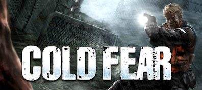

Launcher for Cold Fear (2005 game by Darkworks) which backs up save games on exit.

To use rename the existing game executable to `coldfear_retail.exe` to `coldfear_game.exe`, build this executable with make and make sure you have [7-Zip](https://www.7-zip.org) (specifically the `7z` CLI executable) and [copyparty_sync](https://github.com/stpettersens/copyparty_sync) configured and on your system PATH variable.

Build requires:

* `make` to use the Makefile.
* [LDC](https://github.com/ldc-developers/ldc) compiler ([DMD](https://github.com/dlang/dmd) should also work if you swap out `ldc2` for `dmd` in the Makefile) .
* [UPX](https://github.com/upx/upx) is an optional build dependency if you want to compress the produced `coldfear_retail.exe`.

#### DISCLAIMER

This program was written by me ([stpettersens](https://github.com/stpettersens)), is unofficial and not endorsed by Darkworks as developers of the game or by Ubisoft or Atari as publishers of the game. Use of program is at your own risk and is offered with absolutely no warranty.
